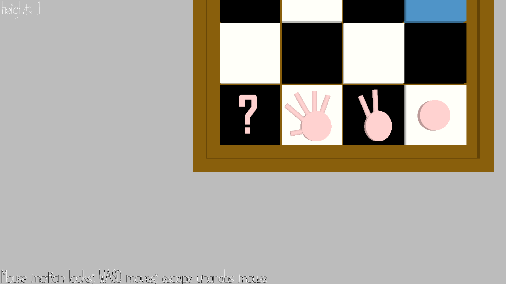

# Rock Paper Scissors Chess

Author: Shao-Ju Wang

Design: In a 4x4 board, player will move their "chess" around, and play rock-paper-scissors if he wants to take another piece.

Networking: Not implemented yet, but here's the flow 
			1. C->S: Initialize
			2. S->C: Black or White is assigned
			3. C->S: Let user choose arrangement (see screenshot), and send to server
			4. C->S: Report what magic card did player choose (rock, paper, or scissors)
			5. S->C: when both player are ready, begin game
			6. S->C: allow client (player) to move
			7. C->S: Client report the move
			8. S->C: Server recognize the move and sent it to other player
			9. Repeat 6-7 until one winner

Screen Shot:

How To Play:

Drag the pieces. 

Sources: (TODO: list a source URL for any assets you did not create yourself. Make sure you have a license for the asset.)

This game was built with [NEST](NEST.md).

